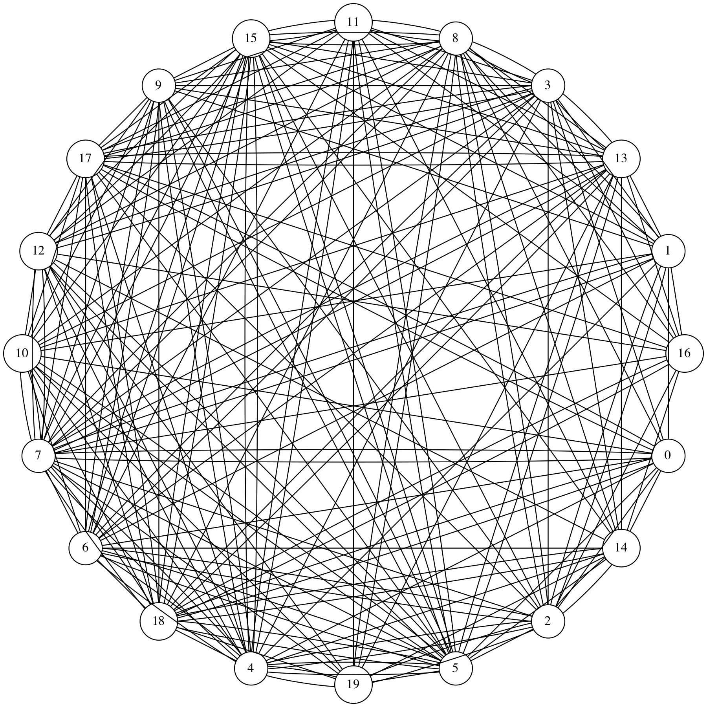
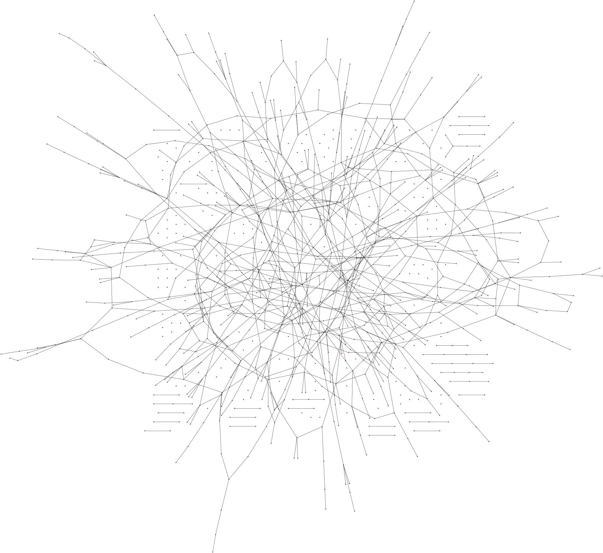

# C-Networks

The C-Networks project contains two programs, written in C, that demonstrate the functionality of both an adjacency matrix and an adjacency list for the creation and maintenance of a graph. Who needs a big bulky NetworkX Python program when you can accomplish the same task with an elegant adjacency list or matrix? This suite of programs serves to demonstrate graph theory programming fundamentals both as a learning exercise and as a set of boilerplate that can be used to build graph relationships in other programs.

The two programs currently in the `c-networks` project are:
 * `list-network`
 * `matrix-network`

The two programs accomplish similar goals, but were created with different goals in mind because of the nature of their formations. Currently, I am studying random networks and have found a lot more use from the `matrix-network` program, which models a random network by link probabilities.

The `list-network` program assigns a link between two random nodes for at most ( N * (N-1) ) / 2 nodes in the graph since that is the maximum number of links in a complete graph. This means that the `list-network` program can repeat links which will make some inter-node connections stronger than others.

The `matrix-network` program goes through each node pair for all N nodes and based on a provided link-making probability, assigns a link between the nodes or not. This method was inspired by work done by Paul Erdos and Alfred Renyi in 1959 at the origin of graph theory. This sort of random network lends itself to many insights regarding the formation of networks within natural phenomena.

Both of the programs are quite fun to fiddle with and can create some insightful figures for learning the principles of graph theory.

## Getting Started

The beautiful thing about creating networks/graphs in C is that they port to most any system quite easily.

### Prerequisites
The only external commands that are run to build figures in this project are shipped with the `graphviz` package.

**Mac**
```
brew install graphviz
```

**Ubuntu/Debian**

The dot package for graphviz should come pre-installed on most ships of Debian, however if it's not there:
```
sudo apt-get install graphviz
```

### Installing
Clone this repository and navigate to the c-networks directory where you'll make the bin directory for executables
```
git clone https://github.com/smit2300/data-structures.git
cd data-structures/graphs-networks/c-networks
mkdir bin
```

Build
```
make all
```

And that's it! You should now have two executables, one for building a graph through the use of an adjacency matrix and the other using an adjacency list.

## Examples

### Adjacency List
**20-node graph in random layout**
```
bin/list-network -d graphviz/20_node_list_graph.dot -n 20 -v
dot -Tpng graphviz/20_node_list_graph.dot -o graphviz/20_node_list_graph.png
```


**15-node graph in circular layout**
```
bin/list-network -d graphviz/15_node_list_graph.dot -n 15 -v
circo -Tpng graphviz/15_node_list_graph.dot -o graphviz/15_node_list_graph.png
```


### Adjacency Matrix
**20-node graph in circular layout**
```
bin/matrix-network -d graphviz/20_node_matrix_graph.dot -n 20 -v
circo -Tpng graphviz/20_node_matrix_graph.dot -o graphviz/20_node_matrix_graph.png
```


**20-node graph in circular layout (higher connectivity)**
```
bin/matrix-network -d graphviz/20_node_matrix_graph_2.dot -n 20 -p 2 -v
circo -Tpng graphviz/20_node_matrix_graph_2.dot -o graphviz/20_node_matrix_graph_2.png
```


**500-node graph with .0005 chance of link formation**
```
bin/matrix-network -n 500 -l 50 -d graphviz/500_node_matrix_graph.dot
sfdp -x -Goverlap=scale -Tpng graphviz/500_node_matrix_graph.dot -o graphviz/500_node_matrix_graph.png
```

