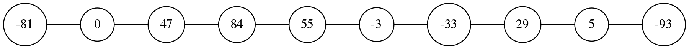
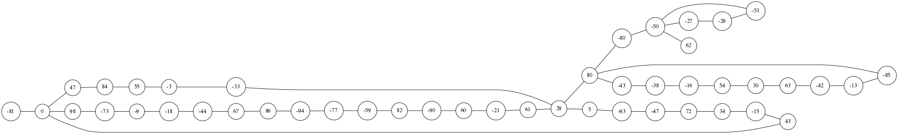

# linked-lists

`linked-lists` is a very basic project for building quick and efficient linked lists with C.

## Getting Started

### Prerequisites
The only external commands that are run for this project are shipped with the `graphviz` package.

**Mac**
```
brew install graphviz
```

**Ubuntu/Debian**

The dot package for graphviz should come pre-installed on most ships of Debian, however if it's not there:
```
sudo apt-get install graphviz
```

### Installing
Clone this repository and navigate to the c-networks directory where you'll make the bin directory for executables
```
git clone https://github.com/smit2300/data-structures.git
cd data-structures/binary-trees
mkdir bin
```

Build
```
make all
```

And that's it! You should now have two executables, one for building a graph through the use of an adjacency matrix and the other using an adjacency list.

## Examples

**10 Random Node Linked List**
```
bin/list -n 10 -d graphviz/10_node_list.dot -v
dot -Tpng graphviz/10_node_list.dot -o graphviz/10_node_list.png
```


**50 Random Node Linked List**
```
bin/list -n 50 -d graphviz/50_node_list.dot -v
dot -Tpng graphviz/50_node_list.dot -o graphviz/50_node_list.png

```

